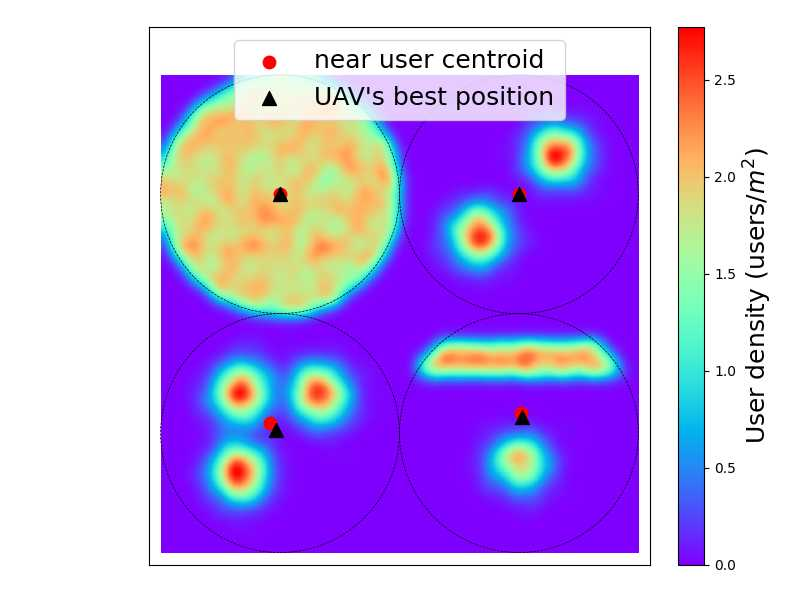
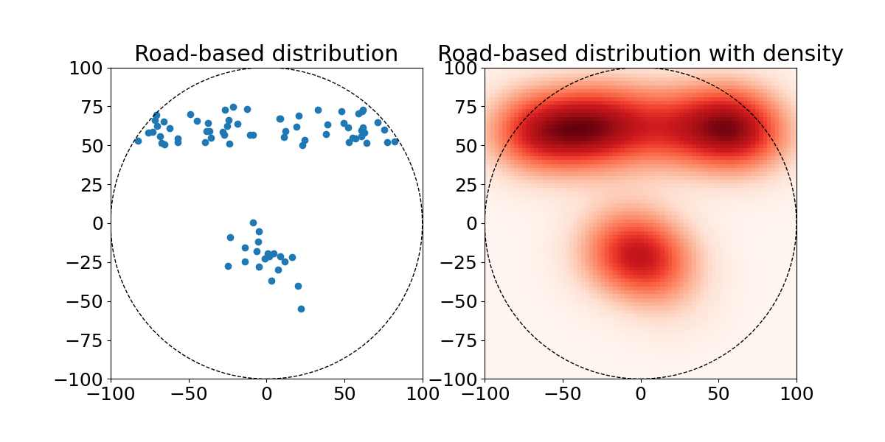
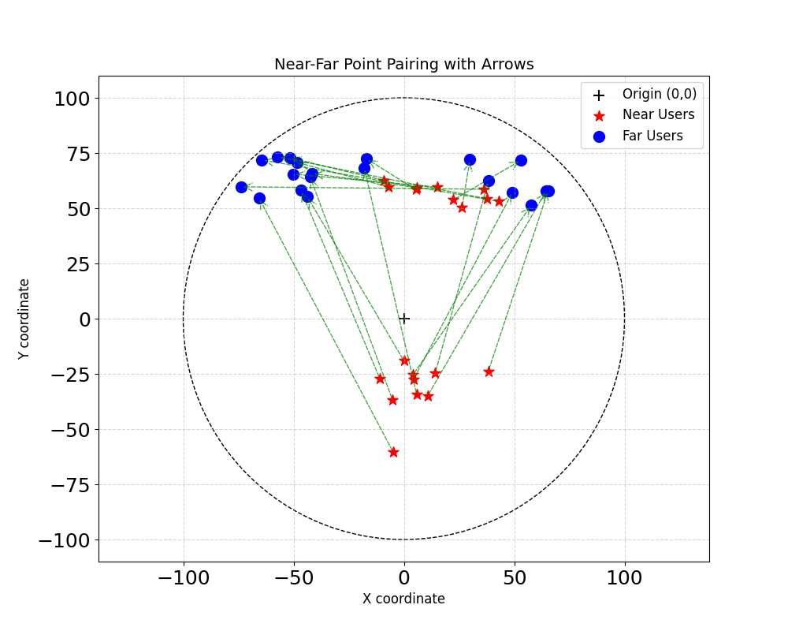
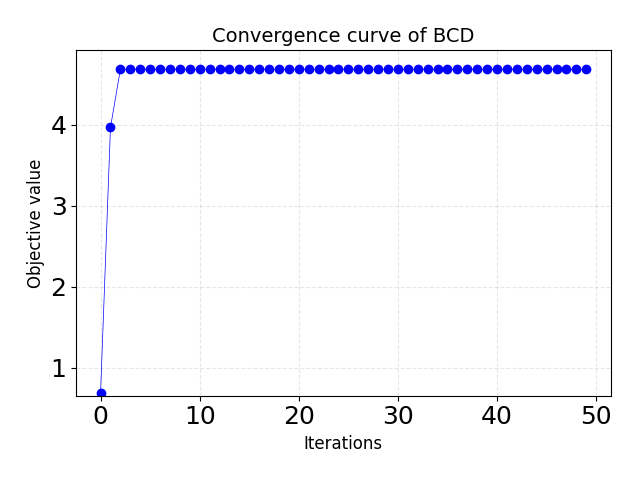
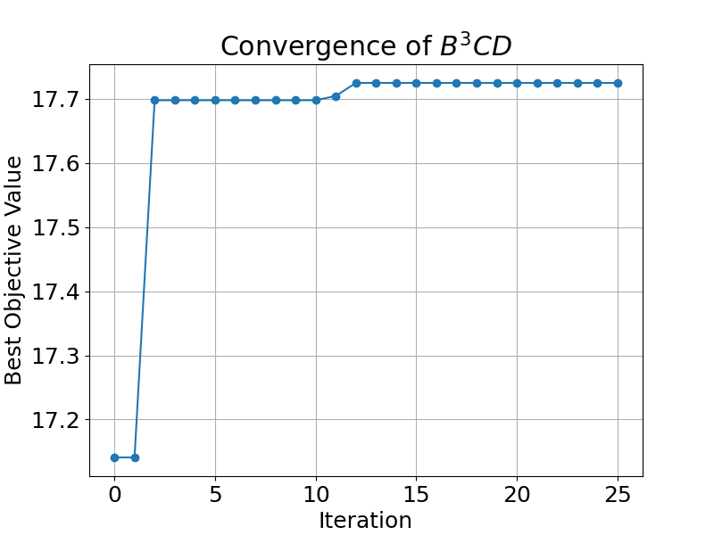

# The B<sup>3</sup>CD Framework for NOMA-UAV - Simulation Code

[](LICENSE)
[](https://www.python.org/)

This repository contains the simulation code for the B<sup>3</sup>CD Framework for NOMA-UAV.


## 🚀 Quick Start
### Installation
```bash
pip install -e .
```

### Run Simulation

To run the simulation, just run the following cmd:
```bash
python main_algorithms/run_simulations.py
```
This will perform the following tasks:
#### 1). Generate Terrestrial Users with Different Distributions
First, we plot 4 kinds of user distributions, and mark the near-user centroids and optimal horizontal UAV positions


```bash
├── simulation_results
├── ├── horizontal_performance
│   ├──└──user_distributions.py         # User Generation
```

#### 2). Generate a UAWN with Road-Based Distributed Users

Second, we use the road-based distributions to generate a NOMA-enabled UAWN with a set of 40 UEs.

```bash
├── scenarios
├── ├── scenario_creators.py            # Create the UAWN
```

The following figures show the user distribution and density.


Then the near users and far users are paired by the nearest distance principle, as shown below.



#### 3). BCD algorithm for Fixed (x, y)
Third, run the BCD algorithm for fixed UAV's horizontal position (x, y) = (0, 0), and plot the convergence curve of
the BCD algorithm


```bash
├── main_algorithms
├── ├── bcd_algorithm.py            # The BCD algorithm
```



#### 4). Bayesian optimization (BO) for Horizontal UAV Deployment
Finally, run the Bayesian optimization (BO) to optimize the horizontal UAV deployment, and plot the convergence curve
of BO.

```bash
├── main_algorithms
├── ├── optimize_uav_position_Bayesian.py            # The B^3CD algorithm
```

## 🤝 Contributing
Pull requests are welcome. For major changes, please open an issue first.

